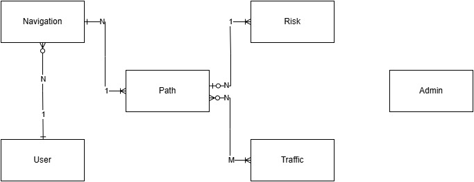
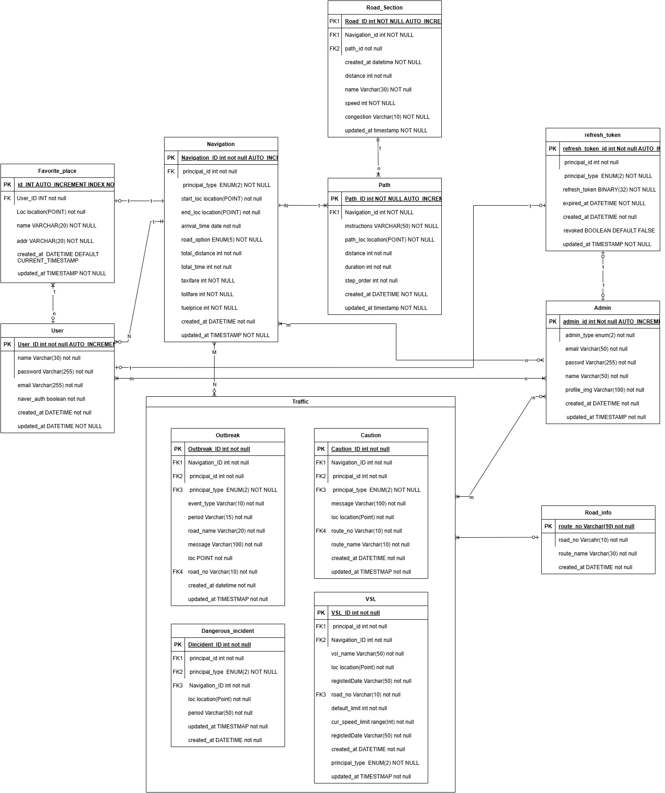

(2025.5.17 기준)

# 🚀 C-NED Backend

🔥 배포된 서비스 링크: 👉 [C-NED API 문서](https://cned.fly.dev/docs#/)  
📑 전체 개발 문서: 👉 [Notion 바로가기](https://www.notion.so/1afbb4312b768015945ee3bf76a6a7d3)

---

## 🧱 데이터베이스 구조

앱 **Doby** 및 관리자 웹 **Dorocy**에서 사용되는 **통합 DB 구조 설계가 완료**되었습니다.  
주요 기능에 따라 테이블이 구분되며, 실시간 주행 정보 및 AI 감지 데이터를 효율적으로 처리할 수 있도록 설계되었습니다.

- 📍 주요 테이블:
  - `navigation`, `path`, `road_section`, `guide` – 경로 및 주행 정보
  - `outbreak`, `caution`, `dangerous_incident`, `vsl`, `road_info` – 교통 돌발 상황 및 위험 정보
  - `user`, `admin`, `refresh_token` – 사용자 및 인증 관리

> 이 설계는 실시간 데이터 스트리밍(WebSocket)과 이벤트 기반 데이터 저장 구조를 모두 고려하여 구축되었습니다.

---
## 🚀 적용한 구조 및 이슈

1. 다형성 fk 적용
2. refresh token 및 access token 분리 설계(mariadb,redis)
3. redis에서의 ttl을 짧게 잡고 블랙리스트 등록을 통해 access token을 효율적으로 관리
4. access token을 요청 시 해당하는 refesh token을 확인하고 만료 시 새로 발급 및 폐기 로직 작성
5. sql alchemy를 통한 orm 구조 매핑
6. 순환 참조 해결
7. refresh token을 해시로 저장 후 시크릿 키를 매번 새로 발급하여 access token을 생성. 이를 통해 보안을 높임
8. point와 linestring을 이용하여 공간 인덱스를 적용
9. 복합키와 인덱스를 활용하여 중복되는 공공 데이터를 정확히 식별
10. 외부 api를 가공하여 db에 알맞게 삽입

---

### 🔹 시스템 추상 구조 (Crow’s Foot 모델)

> 각 주요 엔터티 간의 관계를 **Crow’s Foot 다이어그램**으로 표현한 추상 설계입니다.

---

### 🔸 상세 테이블 설계 (URL 클래스 다이어그램)

> 실제 구현에 사용된 **정규화된 테이블 구조와 필드 정의**를 포함한 상세 설계입니다.

> 📘 **자세한 필드 설명과 제약 조건은 [Notion 문서](https://pouncing-toothpaste-a07.notion.site/DB-1babb4312b7680368fe4f63a87575891?pvs=4)를 참고해주세요.**

---

## 📌 프로젝트 구성

### 🛣️ 앱 (Doby)
- AI 기반 실시간 네비게이션
- 도로 위험 요소 감지 및 안내

### 🖥️ 관리자 웹 (Dorocy)
- 감지 정보 시각화
- AI 성능 모니터링 대시보드

---

## 🔧 기술 스택

- **Backend**: FastAPI  
- **Database**: MariaDB
- **Cache**: Redis
- **외부 API 연동**:  
  - 네이버 오픈 API  
  - 네이버 클라우드 Maps API  
  - 공공 ITS API  
- **배포 환경**:
  - **기존**: Cloudtype (FastAPI 단일 배포)
  - **현재**: Fly.io (FastAPI 서버) + Railway (MariaDB + Redis)

---

## 🚀 배포 전략 (2025.5.17 기준)

### 🗺️ 인프라 아키텍처

| 구성 요소     | 플랫폼    |
|--------------|-----------|
| FastAPI 서버 | Fly.io    |
| MariaDB      | Railway   |
| Redis        | Railway   |
| 환경변수     | Fly.io secrets |
| 빌드         | Dockerfile + `fly.toml` |

---

### 🔄 배포 흐름

1. FastAPI 앱은 `flyctl deploy`로 Fly.io에 직접 배포
2. `.env` 대신 `fly secrets`로 환경변수 주입
3. Railway의 DB/Redis 접속 정보를 환경변수로 가져옴
4. `wait_for_mariadb()`로 초기 DB 연결 대기 로직 설정
5. 로컬과 운영 환경 분리 (`os.getenv()` 기반)

---

### 🧨 Fly.io 마이그레이션 이슈 정리

| 항목 | 내용 |
|------|------|
| ✅ 구조 전환 | Cloudtype → Fly.io(FastAPI) + Railway(RDB/Redis) |
| ⚠️ mise 에러 | `gzip header` 문제로 Python 설치 실패 → 수동 회피 |
| ⚠️ secrets 에러 | `ACCESS_EXPIRE_MINUTES`가 None으로 인식 → 예외처리 필요 |
| ⏳ 초기 지연 | secrets 주입 후 몇 분간 접근 오류 발생함 |
| 🔁 머신 회복 | 머신 재시작 후 작동되나, 자동 재기동 루프는 조심 |
| 🛠 wait_for_mariadb | 연결 실패 시 루프 돌도록 설계 (최대 시도 제한 권장) |

---

### 🧱 Railway 관련 이슈

| 항목                      | 상태                                   |
| ----------------------- | ------------------------------------ |
| 🐘 MariaDB FK 마이그레이션 오류 | ⚠️ 복합키로 인한 FK 실패 → ORM 유효성 검사로 우회    |
| 🔧 다형성 테이블 FK 충돌        | ✅ FK 제거, `@validates`로 유효성 보완        |
| 🐛 로컬 ↔ Railway 차이 발생   | ✅ `FOREIGN_KEY_CHECKS=0` 및 수동 데이터 검증 |
| 🔗 Railway 연결 오류 대응     | ✅ 초기 연결 재시도 루프 삽입, 연결 안정화            |
| 📦 최종 Import 및 정상화      | ✅ 모든 테이블 Railway에 import 완료          |

---

## 🚧 진행 상황

| 항목              | 상태                                     |
| --------------- | -------------------------------------- |
| 📦 DB 설계 및 구축   | ✅ 완료 (앱/웹 통합)                          |
| 🔐 인증 시스템       | 🛠 구현 완료 (JWT + Redis + Refresh Token) |
| 🌐 외부 API 연동    | ✅ 완료                                   |
| 🗺️ 경로 탐색/지도 응답 | ✅ 확인됨                                  |
| 📤 배포 연동        | ✅ 완료                                   |
| 🔌 WebSocket 처리 | 🔜 예정                                  |
| 📱 앱 연동 (Doby)  | 🛠 진행 중                                |
| 🧑‍💼 관리자 대시보드(Dorocy)  | 🔜 예정                                  |
| 🚀 배포 브랜치       | `main` 유지 / `test`에서 개발 중              |

---

> 📋 상세 개발 기록 및 작업 흐름은 Notion에서 확인하세요 → [🔗 Notion 바로가기](https://www.notion.so/1afbb4312b768015945ee3bf76a6a7d3)
 작업 상황은 주기적으로 업데이트 될 예정입니다

