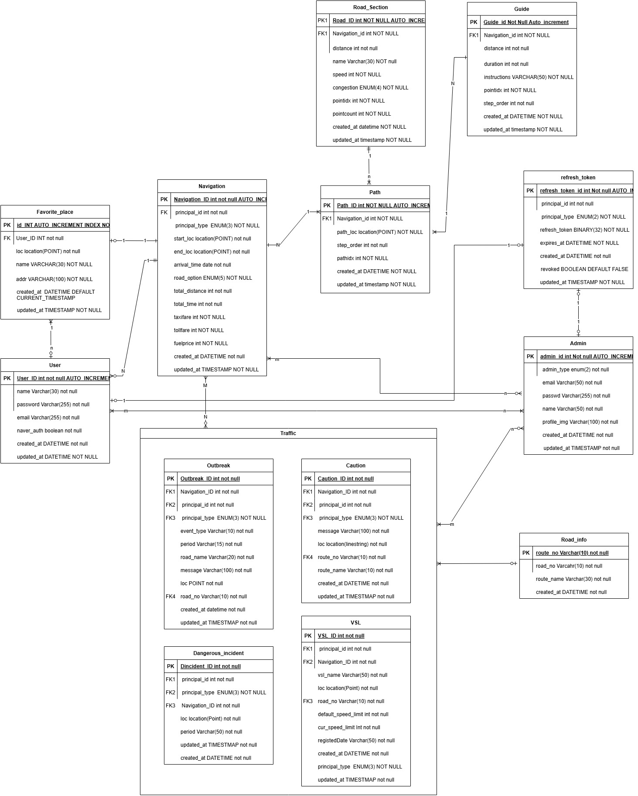

(2025.4.1 기준)

# 🚀 C-NED Backend

🔥 배포된 서비스 링크: 👉 [C-NED API 문서](https://port-0-c-ned-backend-m8d025yhc9939d4f.sel4.cloudtype.app/docs)  
📑 전체 개발 문서: 👉 [Notion 바로가기](https://www.notion.so/1afbb4312b768015945ee3bf76a6a7d3)

---

## 🧱 데이터베이스 구조

앱(Doby) 및 관리자 웹(Dorocy)의 통합 ERD 설계가 완료되었습니다.  
- 주요 테이블: `navigation`, `path`, `road_section`, `outbreak`, `caution`, `dangerous_incident`, `vsl`, `user`, `admin`, `refresh_token`
- 실시간 경로 데이터와 이벤트 기반 교통 정보 관리를 지원하는 구조입니다.

> 📘 **자세한 필드 설명과 제약 조건은 [Notion 문서](https://pouncing-toothpaste-a07.notion.site/DB-1babb4312b7680368fe4f63a87575891?pvs=4)를 참고해주세요.**

---

## 📌 프로젝트 구성

### 🛣️ 앱 (Doby)
- AI 기반 실시간 네비게이션
- 도로 위험 요소 감지 및 안내

### 🖥️ 관리자 웹 (Dorocy)
- 감지 정보 시각화
- AI 성능 모니터링 대시보드

---

## 🔧 기술 스택

- **Backend**: FastAPI  
- **DB**: MariaDB + Redis  
- **외부 API**: 네이버 개발자센터 오픈 API, 네이버 클라우드 플랫폼 MAPS API, ITS 공공 API
- **배포**: cloudtype

---

## 🚧 진행 상황

| 항목 | 상태 |
|------|------|
| 📦 DB 설계 및 구축 | ✅ 완료 (앱/웹 통합) |
| 🔐 인증 시스템 | 🛠 구현 중 (JWT + Redis + Refresh Token) |
| 📡 실시간 API | 🔜 WebSocket 구조 설계 예정 |
| 🚀 배포 브랜치 | `main` 유지 / `test`에서 개발 중 |

> 📋 상세 개발 기록 및 작업 흐름은 Notion에서 확인하세요 → [🔗 Notion 바로가기](https://www.notion.so/1afbb4312b768015945ee3bf76a6a7d3)
 작업 상황은 주기적으로 업데이트 될 예정입니다
